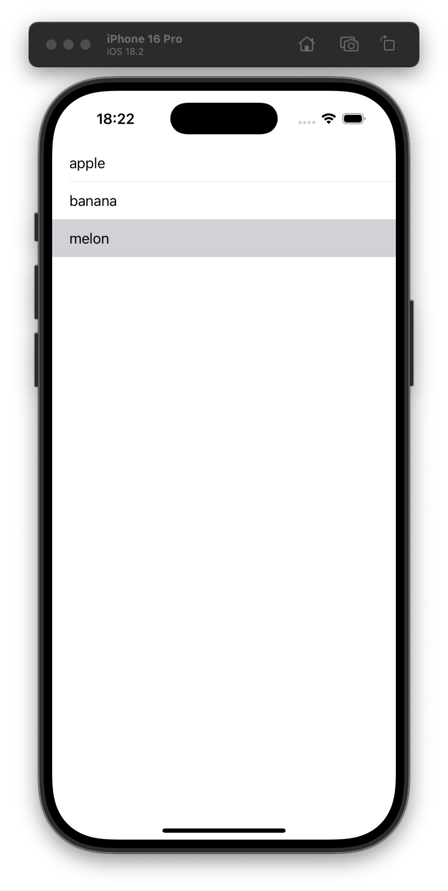

# Challenge 1: Simple “Word List” (Beginner)

This is a study project focusing on two primary objectives:

1. **Main Goal**: Learn how to override `loadView()` in a single-screen app.  
2. **Secondary Goal**: Practice using a static `UITableView` to display a list of words.

## Overview

- **Challenge**:  
  - Create a new `UIViewController` subclass called `WordListViewController`.  
  - Override `loadView()` to build the UI entirely in code.  
  - Display a static list of words in a table view.  
- **Instructions**:
  1. **Override `loadView()`**  
     - Create a `UIView` as the main container.  
     - Create a `UITableView` and add it as a subview.  
     - Set up Auto Layout constraints or frames in code.  
  2. **In `viewDidLoad()`**  
     - Set the table view’s `dataSource` and `delegate`.  
     - Use a simple array of words (e.g. `["Apple", "Banana", "Cherry"]`).  
     - *(Optionally)* Call `tableView.reloadData()` after setting the data source if needed.  
  3. **No Core Data**—keep it simple.  
  4. **Run the app** to ensure you can see the list of words.

## Learning Points

- **Basic usage of `loadView()`**: Creating a main view and subviews entirely in code without using Storyboards.  
- **Familiarity with `UITableView`**: Understanding the minimal setup needed to display static data (data source, delegate, registering cells). 

